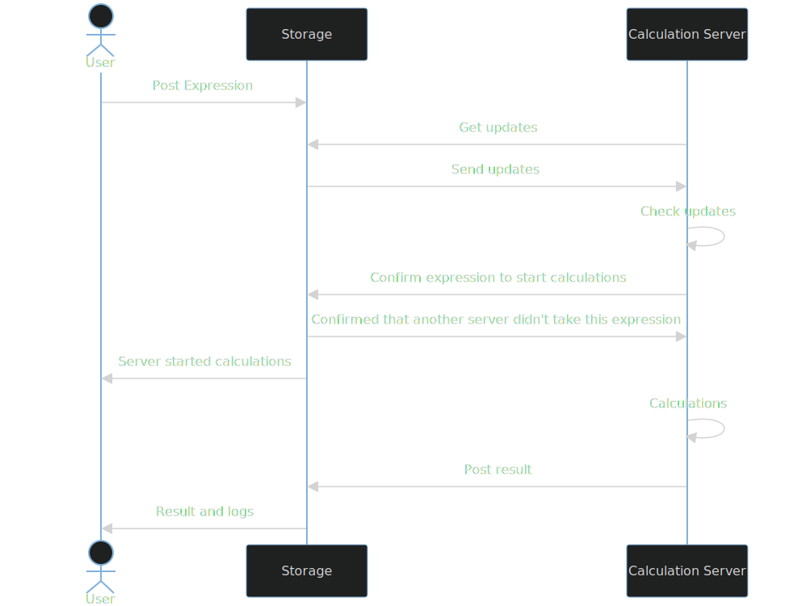

# Distributed Calculations
Distributed calculations written in Go language. This project assumes all standard mathematical operations (+, /, *, -) need a lot of time to be calculated. Therefore, it would be logical to create a system that will organize the work of several machines to calculated given expressions as fast as possible.

# Configure (using .env)
You can skip this part, if you will use docker to deploy the project.\
Create `calculationServer/.env`, `storage/.env`, `ui-storage/.env` files (specifies environmental variables, i.e. config). To do this you can use `.env.template` (`calculationServer/.env.template`, `storage/.env.template`, `ui-storage/.env`) and just put your values there.
### CalculationServer
- `STORAGE_URL` - URL of storage server ***(If you are using docker to deploy calculation server write `http://host.docker.internal:<storage port>`!!!)***
- `NUMBER_OF_CALCULATORS` - Number of calculators (workers) that will be created
- `SEND_ALIVE_DURATION` - Duration of sending alive message to storage server
- `CALCULATION_SERVER_NAME` - Name of a calculation server

### Storage
- `POSTGRESQL_USER` - User for database
- `POSTGRESQL_PASSWORD` - Password for database
- `POSTGRESQL_DB` - Database name
- `POSTGRESQL_HOST` - Host of database ***(If you are using docker to deploy storage write `host.docker.internal`!!!)***
- `POSTGRESQL_PORT` - Port of database
- `RESET_POSTGRESQL` - If `TRUE` then database will be reset on start of the storage server
- `CHECK_SERVER_DURATION` - Duration of checking if calculation server is alive

### Ui-storage
- `REACT_APP_STORAGE_API_URL` - URL of storage server

# Database Start
***Docker is required! ([install](https://docs.docker.com/engine/install/))***

```shell
docker run --name db -p 5432:5432 -e  POSTGRES_USER=user -e POSTGRES_PASSWORD=password -d postgres:16
```

You can also specify local directory for database storage using: `-v <local path>:/var/lib/postgresql/data postgres:16`

*Based on https://hub.docker.com/_/postgres*

You can also start docker somehow else.

When docker is running, you need to reset it, before program can use it, so on the first start of `storage/main.go` set in your `storage/.env` `RESET_POSTGRESQL=TRUE`. After the first start, do not forget to set `RESET_POSTGREQL` to `FALSE`, or it will wipe data.

# Build and Run
## Docker
### If you do not want to use .env files
```shell
cd calculationServer
docker build -t calculation-server .
docker run -d --name calculation-server -e STORAGE_URL=http://host.docker.internal:8080/api/v1 -e NUMBER_OF_CALCULATORS=5 -e SEND_ALIVE_DURATION=1 -e CALCULATION_SERVER_NAME=serverName calculation-server
cd ..
cd storage
docker build -t storage .
docker run -p 8080:8080 -d --name storage -e POSTGRESQL_USER=user -e POSTGRESQL_PASSWORD=password -e POSTGRESQL_DB=postgres -e POSTGRESQL_HOST=host.docker.internal -e POSTGRESQL_PORT=5432 -e RESET_POSTGRESQL=TRUE -e CHECK_SERVER_DURATION=5 storage
cd ..
cd ui-storage
docker build -t ui-storage .
docker run -p 3000:3000 -d --name ui-storage ui-storage
```

### If you want to use .env files
Configure three `.env` files (see **Configure (using .env)** section) and then run:
```shell
cd calculationServer
docker build -t calculation-server .
docker run --env-file .env -d --name calculation-server calculation-server
cd ..
cd storage
docker build -t storage .
docker run --env-file .env -p 8080:8080 -d --name storage storage
cd ..
cd ui-storage
docker build -t ui-storage .
docker run --env-file .env -p 3000:3000 -d --name ui-storage ui-storage
```

## Not Docker
If you have error in powershell `cannot be loaded because running scripts is disabled on this
system.` you can [fix it](https://stackoverflow.com/questions/54776324/powershell-bug-execution-of-scripts-is-disabled-on-this-system) or run commands in CMD.
### Go
[Install `go`](https://golang.org/doc/install)
```shell
mkdir out
cd calculationServer
go build -o ../out .
cd ..
cd storage
go build -o ../out .
cd ..
```
You also need to create a `.env` file in `out` folder (i.e. near executables) (see `storage/.env` and `calculationServer/.env`) or set environmental variables in your system. Then run executable files in `out` directory (in a terminal).

[Install `npm`](https://docs.npmjs.com/downloading-and-installing-node-js-and-npm) if you do not have it.
### React
```shell
cd ui-storage
npm install
npm run build
npm install -g serve
serve -s build
```


# API Documentation for Storage
Documentation is always available (without rebuild of the documentation) available at http://localhost:8080/swagger/index.html
Generate documentation (swagger):
[install swag](https://github.com/swaggo/swag)
````shell
cd storage
swag fmt
swag init
````

# How does it work

*Storage* is a hosted server that stores all the data about calculations and *calculation servers*. It also checks if *calculation servers* are alive.\
*Calculation server* is a client that interacts with *storage*. Using getUpdates endpoint it gets all the calculations that are not calculated yet. Because there is possibly more than one *calculation server* that runs at the same time, *calculation server* asks for a confirmation from the *storage*, *storage* give this confirmation only ones to the first *calculation server* that asks for it. While *calculation server* is working with expression, it sends messages to *storage* to indicate that *calculation server* is online and working. If *calculation server* is not online, *storage* will pass an expression to another *calculation server*.\
*User* can see the moment of confirmation and the result of the calculation in the UI.

### Process inside the calculation server


# Tests
For storage testing database is required (see **Database Start** section), also do not forget to change `calculationServer/tests/config_test.go` and `storage/tests/config_test.go` to specify where is postgresql database, number of calculators, and secret key.\
To run tests:
````shell
cd calculationServer
go test -v ./tests/...
cd ..
cd storage
go test -v ./tests/...
````