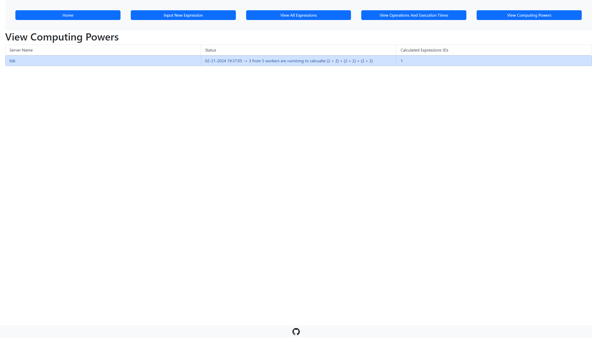

# Contact
https://t.me/VUVAVIVU
# Distributed Calculations
Distributed calculations written in Go language. This project assumes all standard mathematical operations (+, /, *, -) need a lot of time to be calculated. Therefore, it would be logical to create a system that will organize the work of several machines to calculated given expressions as fast as possible.

# Configure (using .env)
You can skip this part, if you will use docker to deploy the project.\
Create `calculationServer/.env`, `storage/.env`, `ui-storage/.env` files (specifies environmental variables, i.e. config). To do this you can use `.env.template` (`calculationServer/.env.template`, `storage/.env.template`, `ui-storage/.env`) and just put your values there.
### CalculationServer
- `STORAGE_URL` - URL of storage server ***(If you are using docker to deploy calculation server write `http://host.docker.internal:<storage port>`!!!)***
- `NUMBER_OF_CALCULATORS` - Number of calculators (workers) that will be created
- `SEND_ALIVE_DURATION` - Duration of sending alive message to storage server
- `CALCULATION_SERVER_NAME` - Name of a calculation server

### Storage
- `POSTGRESQL_USER` - User for database
- `POSTGRESQL_PASSWORD` - Password for database
- `POSTGRESQL_DB` - Database name
- `POSTGRESQL_HOST` - Host of database ***(If you are using docker to deploy storage write `host.docker.internal`!!!)***
- `POSTGRESQL_PORT` - Port of database
- `RESET_POSTGRESQL` - If `TRUE` then database will be reset (drop table expressions) on start of the storage server
- `CHECK_SERVER_DURATION` - Duration of checking if calculation server is alive

### Ui-storage
- `REACT_APP_STORAGE_API_URL` - URL of storage server

# Run
***Docker is required! ([install](https://docs.docker.com/engine/install/))***
## Run With Docker
```shell
docker-compose up
```

## Run From Releases (windows)
Start database:
```shell
docker run --name db -p 5432:5432 -e  POSTGRES_USER=user -e POSTGRES_PASSWORD=password -d postgres:16
```

Check [releases](https://github.com/Anton-beep/distributed_calculations_go/releases/latest) and download the latest version.

# Build
If you have error in powershell `cannot be loaded because running scripts is disabled on this
system.` you can [fix it](https://stackoverflow.com/questions/54776324/powershell-bug-execution-of-scripts-is-disabled-on-this-system) or run commands in CMD.
### Go
[Install `go`](https://golang.org/doc/install)
```shell
mkdir out
cd calculationServer
go build -o ../out .
cd ..
cd storage
go build -o ../out .
cd ..
```

### React
[Install `npm`](https://docs.npmjs.com/downloading-and-installing-node-js-and-npm)
```shell
cd ui-storage
npm install
npm run build
mv build ../out
cd ..
```
You also need to create a `.env` file in `out` folder (i.e. near executables) (see `storage/.env.template`, `calculationServer/.env.template` and `ui-storage/.env.template`) or set environmental variables in your system. Then run executable files in `out` directory (in a terminal).

API is available at http://localhost:8080/api/v1 and UI at http://localhost:3000.

# API Documentation for Storage
Documentation is always available (without rebuild of the documentation) available at http://localhost:8080/swagger/index.html
Generate documentation (swagger):
[install swag](https://github.com/swaggo/swag)
````shell
cd storage
swag fmt
swag init
````

# How does it work

*Storage* is a hosted server that stores all the data about calculations and *calculation servers*. It also checks if *calculation servers* are alive.\
*Calculation server* is a client that interacts with *storage*. Using getUpdates endpoint it gets all the calculations that are not calculated yet. Because there is possibly more than one *calculation server* that runs at the same time, *calculation server* asks for a confirmation from the *storage*, *storage* give this confirmation only ones to the first *calculation server* that asks for it. While *calculation server* is working with expression, it sends messages to *storage* to indicate that *calculation server* is online and working. If *calculation server* is not online, *storage* will pass an expression to another *calculation server*.\
*User* can see the moment of confirmation and the result of the calculation in the UI.

### Process inside the calculation server


Expression converts to RPN (Reversed Polish Notation) notation using [Shunting yard algorithm](https://en.wikipedia.org/wiki/Shunting_yard_algorithm), so it can be calculated using a stack.\
To apply concurrent calculations, RPN is parsed to instructions, which contains information such as index of the first number in the instructions slice, index of the second number in the instructions slice, operation type (add, subtract, multiply, divide).\
Pool organizes the work of several workers (calculators) that calculate the instructions.\
When all instructions are calculated, the result is sent to the storage server.

# Screenshots




# Tests
You can find unit tests in `calculationServer/tests` and `storage/tests`.\
For storage testing database is required (see **Database Start** section), also do not forget to change `calculationServer/tests/config_test.go` and `storage/tests/config_test.go` to specify where is postgresql database, number of calculators, and secret key.\
To run tests:
````shell
cd calculationServer
go test -v ./tests/...
cd ..
cd storage
go test -v ./tests/...
````

You can find integration tests in `integrationTesting/integration_test.go`.\
**Start docker engine before**
```shell
cd integrationTesting
go test -v .
```


# Build gRPC
gRPC is used to communicate between storage and calculation servers.\
To build gRPC you need to have `protoc` installed.
```shell
cd calculationServer/internal/storageclient
protoc --go_out=. --go_opt=paths=source_relative --go-grpc_out=. --go-grpc_opt=paths=source_relative expressions.proto
```
```shell
cd storage/internal/gRPCServer
protoc --go_out=. --go_opt=paths=source_relative --go-grpc_out=. --go-grpc_opt=paths=source_relative expressions.proto
```
